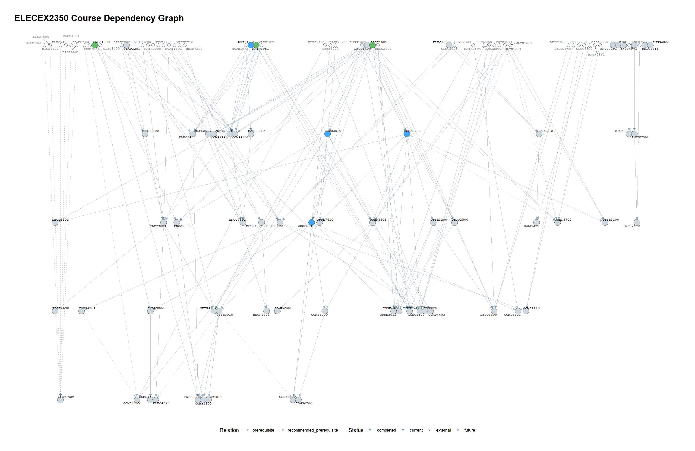

# UQ Course Graph

[](https://github.com/PelerYuan/uq-course-graph/actions/workflows/r-checks.yml) [](LICENSE)

A reproducible R workflow for collecting public University of Queensland course information, parsing prerequisite relationships, building a directed dependency graph, and producing filtered network and statistics plots.



## What this project does

The pipeline turns a UQ plan or program page into:

- cleaned course metadata;
- prerequisite and recommended-prerequisite edge tables;
- JSON prerequisite logic trees;
- a manual-review queue for rules that cannot be represented as course edges;
- a graph object with external prerequisite nodes;
- network plots and course statistics.

## Requirements

- R 4.1 or newer;
- Google Chrome, required by `chromote` for JavaScript-rendered requirements pages;
- an internet connection for the scraping stage.

Install dependencies once:

```r
source("install_deps.R")
```

## Quick start

```powershell
Copy-Item config.example.R config.R
```

Edit `config.R`:

```r
PROGRAM_CODE <- "ELECEX2350"
PROGRAM_ROUTE_TYPE <- "plan"
ACADEMIC_YEAR <- 2026
COMPLETED_COURSES <- c("MATH1051")
CURRENT_COURSES <- c("CSSE2310")
```

Run the stages from the repository root:

```r
source("01_scrape.R")
source("02_parse.R")
source("03_review.R")
source("04_build_graph.R")
source("05_visualize.R")
```

The scraper writes intermediate files to `data/`; generated figures go to `output/`.

## Finding a UQ code

Open the UQ Programs and Courses website and find the requirements page for your degree or plan. Copy the code and route from the URL. Supported routes are:

```text
/requirements/plan/CODE/YEAR
/requirements/program/CODE/YEAR
```

Set `PROGRAM_CODE`, `PROGRAM_ROUTE_TYPE`, and `ACADEMIC_YEAR` to match that URL.

## Manual review

Some requirements are free text, for example credit totals or prior academic qualifications. These are written to `data/manual_review.csv`. Complete the CSV template with a spreadsheet and rerun the review stage. Manual review is expected and prevents uncertain rules from being silently converted into incorrect graph edges.

## Graph selectors

```r
source("R/visualize_graph.R")
g <- readRDS("data/graph_object.rds")
g <- tag_course_status(g, COMPLETED_COURSES, CURRENT_COURSES)

select_ancestors(g, "CSSE4010", depth = 2) |>
  plot_course_graph("output/csse4010_prerequisites.png")

select_descendants(g, "CSSE1001") |>
  plot_course_graph("output/csse1001_unlocks.png")
```

`select_by_prefix()` is a hard filter and removes other disciplines. `highlight_prefix` keeps the complete graph and changes visual emphasis only.

## Repository structure

- `R/`: reusable function definitions;
- `01_*.R` to `05_*.R`: user-facing pipeline stages;
- `examples/`: reproducible sample outputs and figures;
- `tests/`: parser and configuration tests;
- `docs/`: architecture, data model, and troubleshooting;
- `data/` and `output/`: local generated files.

See [the architecture guide](docs/architecture.md), [the data model](docs/data-model.md), and [troubleshooting](docs/troubleshooting.md) for details.

## Limitations and responsible use

UQ page structure and available years may change. The scraper stops when the rendered course list is empty and reports failed course requests. Flattened edge counts treat `A or B` as two alternatives, so prerequisite counts are an upper bound. The tool reads public course information; use the built-in delay and avoid high-volume requests.

## Contributing

Bug reports, documentation improvements, and pull requests are welcome. Read [CONTRIBUTING.md](CONTRIBUTING.md) before opening a change.

## License

MIT. See [LICENSE](LICENSE).
