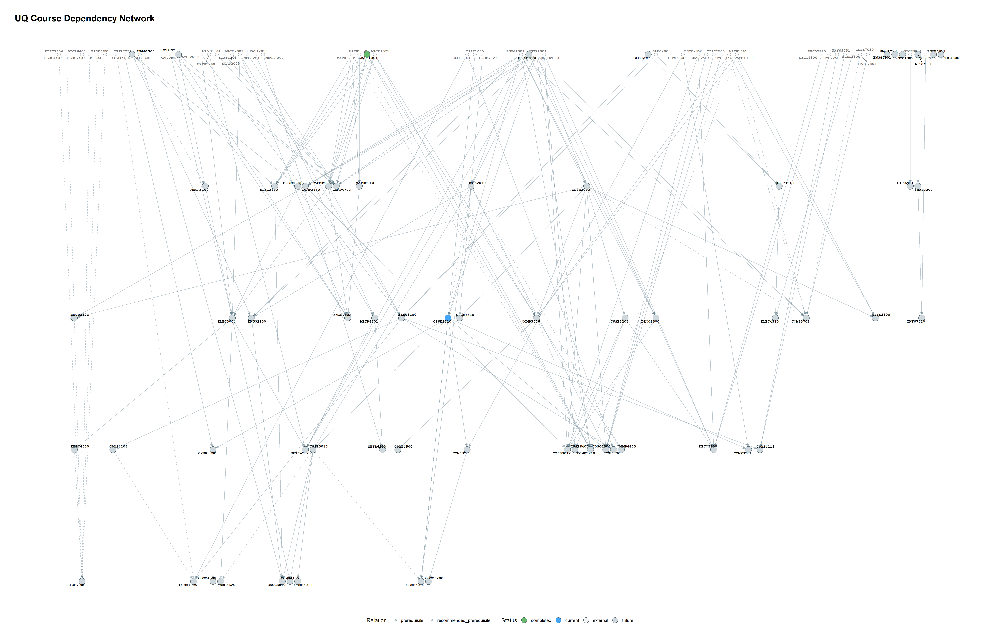
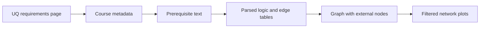

# UQ Course Graph

> Turn a UQ curriculum into a clear, explorable prerequisite network.

[Start the complete workflow](#/pages/getting-started) [View the repository](https://github.com/PelerYuan/uq-course-graph)



UQ Course Graph is an R workflow for turning a University of Queensland plan or program into a prerequisite network. It helps students identify course pathways, find gateway courses, and explore what a completed course can unlock.

## The five-stage workflow



1. Scrape the public requirements page and course details.
2. Parse prerequisite expressions while preserving AND/OR logic.
3. Review statements that contain non-course rules.
4. Build and validate a directed graph.
5. Select, plot, and interpret the part of the graph that answers your question.

## Start here

- Follow the [complete workflow](#/pages/getting-started) for your first run.
- Read [selector recipes](#/pages/selectors/overview) when you already have `graph_object.rds`.
- Open the [function reference](#/pages/reference/selectors) for signatures and parameters.

## Project boundary

The tool describes published course relationships. It does not decide whether a student satisfies every degree rule, guarantee that a course will be offered, or replace official UQ program advice. Credit totals, grade thresholds, and other non-course rules remain visible in the manual-review outputs.

## Quick start

```r
source("install_deps.R")
file.copy("config.example.R", "config.R")
# edit config.R
source("01_scrape.R")
source("02_parse.R")
source("03_review.R")
source("04_build_graph.R")
source("05_visualize.R")
```
