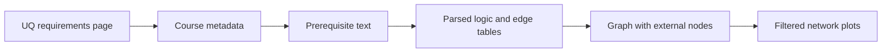

# UQ Course Graph

> Turn a UQ curriculum into a clear, explorable prerequisite network.

[Start the complete workflow](/pages/getting-started.md) [View the repository](https://github.com/PelerYuan/uq-course-graph)


*Click the graph to enlarge it. [Open the full-resolution image](assets/images/hero-course-dependency-4k.png ':ignore') to inspect individual course labels.*

UQ Course Graph is an R workflow for turning a University of Queensland plan or program into a prerequisite network. It helps students identify course pathways, find gateway courses, and explore what a completed course can unlock.

## Explore the gallery

See [12 real examples with complete, runnable R code](/pages/gallery.md), from focused prerequisite chains to whole-curriculum statistics. Each example uses the bundled data, so you can try it before scraping your own plan.

<div class="gallery-grid">
<a class="gallery-card" href="#/pages/gallery?id=view-04-two-levels"><strong>Trace prerequisites</strong><span>Compare direct, two-level, and complete prerequisite chains.</span></a>
<a class="gallery-card" href="#/pages/gallery?id=view-09-prefix-highlight"><strong>Explore disciplines</strong><span>Compare filtering with highlighting while preserving context.</span></a>
<a class="gallery-card" href="#/pages/gallery?id=view-11-gateways"><strong>Find gateway courses</strong><span>Rank courses using the network's downstream reach.</span></a>
</div>

## The five-stage workflow



1. Scrape the public requirements page and course details.
2. Parse prerequisite expressions while preserving AND/OR logic.
3. Review statements that contain non-course rules.
4. Build and validate a directed graph.
5. Select, plot, and interpret the part of the graph that answers your question.

## Start here

- Follow the [complete workflow](/pages/getting-started.md) for your first run.
- Read [selector recipes](/pages/selectors/overview.md) when you already have `graph_object.rds`.
- Open the [function reference](/pages/reference/selectors.md) for signatures and parameters.

## Project boundary

The tool describes published course relationships. It does not decide whether a student satisfies every degree rule, guarantee that a course will be offered, or replace official UQ program advice. Credit totals, grade thresholds, and other non-course rules remain visible in the manual-review outputs.

## Quick start

After [installation](/pages/installation.md), run this small synthetic example. It demonstrates the workflow without making website requests; the gallery uses a separate captured public snapshot.

```r
library(uqcoursegraph)
config <- uq_config(program_code = "DEMO", academic_year = 2026)
import_course_data(example_file("demo_courses.csv"), config,
                   source_label = "Bundled synthetic tutorial")
run_pipeline(config)
```

For a source checkout, replace `library(uqcoursegraph)` with `source("scripts/load_project.R")`. Follow the [complete workflow](/pages/getting-started.md) to configure your own curriculum and complete manual review. Existing users should read [migration notes](/pages/migration.md).
