# Gallery

Choose a question, inspect the actual R output, and copy the complete code below it. Click any large result image to zoom, or open the original PNG to read individual labels. Every example can run independently from the repository root.

## Choose a view

<div class="gallery-grid">

<a class="gallery-card" href="#/pages/gallery?id=view-01-overview"><strong>The whole curriculum</strong><span>Where are the main pathways?</span></a>

<a class="gallery-card" href="#/pages/gallery?id=view-02-exact"><strong>A shortlist of courses</strong><span>How are these five courses connected?</span></a>

<a class="gallery-card" href="#/pages/gallery?id=view-03-direct"><strong>Direct prerequisites</strong><span>What immediately precedes CSSE4010?</span></a>

<a class="gallery-card" href="#/pages/gallery?id=view-04-two-levels"><strong>Two levels of prerequisites</strong><span>What comes before the direct prerequisites?</span></a>

<a class="gallery-card" href="#/pages/gallery?id=view-05-all-ancestors"><strong>The complete prerequisite chain</strong><span>Which foundations lead to CSSE4010?</span></a>

<a class="gallery-card" href="#/pages/gallery?id=view-06-descendants"><strong>Downstream pathways</strong><span>Which courses are downstream of CSSE1001?</span></a>

<a class="gallery-card" href="#/pages/gallery?id=view-07-neighborhood"><strong>A local neighborhood</strong><span>What is connected to CSSE2310 within one step?</span></a>

<a class="gallery-card" href="#/pages/gallery?id=view-08-prefix-filter"><strong>Keep only one discipline</strong><span>What remains when only ELEC courses are kept?</span></a>

<a class="gallery-card" href="#/pages/gallery?id=view-09-prefix-highlight"><strong>Highlight without removing context</strong><span>Where does ELEC sit in the full curriculum?</span></a>

<a class="gallery-card" href="#/pages/gallery?id=view-10-composition"><strong>Combine traversal and discipline</strong><span>Which CSSE and ELEC courses are downstream of CSSE1001?</span></a>

<a class="gallery-card" href="#/pages/gallery?id=view-11-gateways"><strong>Gateway courses</strong><span>Which courses reach the largest downstream networks?</span></a>

<a class="gallery-card" href="#/pages/gallery?id=view-12-disciplines"><strong>Discipline and course level</strong><span>How is the course list distributed?</span></a>

</div>

## Before you start

1. Follow [Installation](installation.md), clone the repository, and open R in the repository root.
2. Run `source("install_deps.R")` once if the dependencies are not installed.
3. Copy any complete code block below into R. Results are saved under `output/gallery/`.

To generate all 12 results in one run, use `source("examples/gallery.R")`, or run `Rscript examples/gallery.R` in a terminal. The [downloadable recipes](https://github.com/PelerYuan/uq-course-graph/tree/master/examples/gallery) contain the same code shown here.

These figures use a bundled ELECEX2350 example snapshot: `examples/gallery_courses.csv` (course codes and names) and `examples/prereq_edges.csv` (parsed relationships). They are examples, not a live course catalogue. Status colors are illustrative. No website requests or untracked `graph_object.rds` files are required.

**Read arrows from prerequisite to dependent course.** Solid edges represent prerequisites and dashed edges recommended prerequisites. An edge does not encode the complete AND/OR expression or credit and grade rules. See [limitations](results/limitations.md) before interpreting a path as an enrolment decision.


## The whole curriculum :id=view-01-overview

**Where are the main pathways?** The full graph provides context. Dense areas are a reason to switch to a focused selector; they are not a measure of course difficulty.

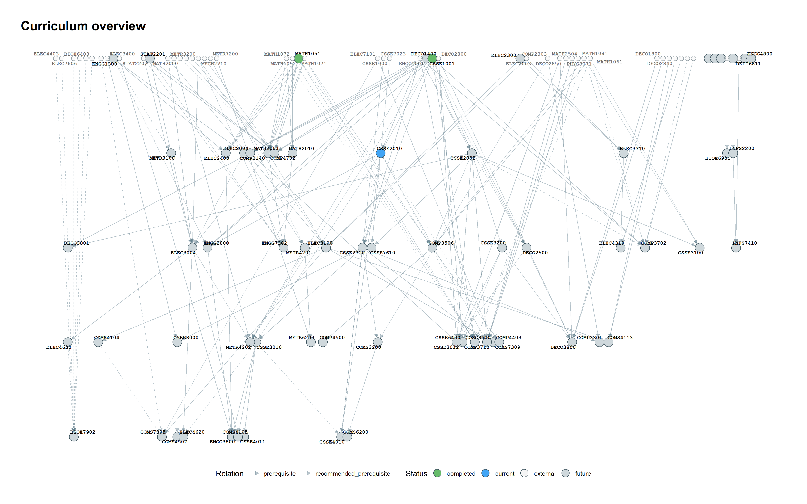

[Open original PNG](../assets/images/gallery/01-overview.png ':ignore') · [Read the tutorial](results/network.md) · [Download this R recipe](https://raw.githubusercontent.com/PelerYuan/uq-course-graph/master/examples/gallery/01-overview.R ':ignore')

```r
# Run from the repository root after installing dependencies.
source("R/build_graph.R")
source("R/visualize_graph.R")
source("R/plot_stats.R")

# A bundled example: no scraping, config.R, or private RDS file is needed.
courses_file <- "examples/gallery_courses.csv"
edges_file <- "examples/prereq_edges.csv"
g <- build_course_graph(courses_file, edges_file)

# Illustrative statuses, not a real student's record.
g <- tag_course_status(g,
  completed = c("CSSE1001", "MATH1051"), current = "CSSE2010")
output_dir <- "output/gallery"
dir.create(output_dir, recursive = TRUE, showWarnings = FALSE)
set.seed(20260910)
output_file <- file.path(output_dir, "01-overview.png")

view <- g
plot_course_graph(view, output_file, title = "Curriculum overview", width = 16, height = 10, dpi = 240)
```


## A shortlist of courses :id=view-02-exact

**How are these five courses connected?** Only the named nodes and edges between them remain. Intermediate courses are not added automatically, so a missing edge does not prove two courses are unrelated.

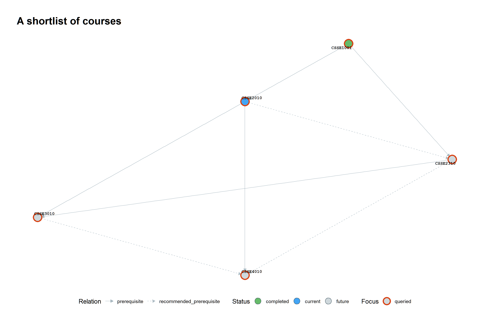

[Open original PNG](../assets/images/gallery/02-exact.png ':ignore') · [Read the tutorial](selectors/exact.md) · [Download this R recipe](https://raw.githubusercontent.com/PelerYuan/uq-course-graph/master/examples/gallery/02-exact.R ':ignore')

```r
# Run from the repository root after installing dependencies.
source("R/build_graph.R")
source("R/visualize_graph.R")
source("R/plot_stats.R")

# A bundled example: no scraping, config.R, or private RDS file is needed.
courses_file <- "examples/gallery_courses.csv"
edges_file <- "examples/prereq_edges.csv"
g <- build_course_graph(courses_file, edges_file)

# Illustrative statuses, not a real student's record.
g <- tag_course_status(g,
  completed = c("CSSE1001", "MATH1051"), current = "CSSE2010")
output_dir <- "output/gallery"
dir.create(output_dir, recursive = TRUE, showWarnings = FALSE)
set.seed(20260910)
output_file <- file.path(output_dir, "02-exact.png")

view <- select_courses(g, c("CSSE1001", "CSSE2010", "CSSE2310", "CSSE3010", "CSSE4010"))
plot_course_graph(view, output_file, title = "A shortlist of courses",
                  width = 12, height = 8, dpi = 240)
```


## Direct prerequisites :id=view-03-direct

**What immediately precedes CSSE4010?** depth = 1 follows incoming edges by one step and retains the target. Compare this compact view with the next two examples.

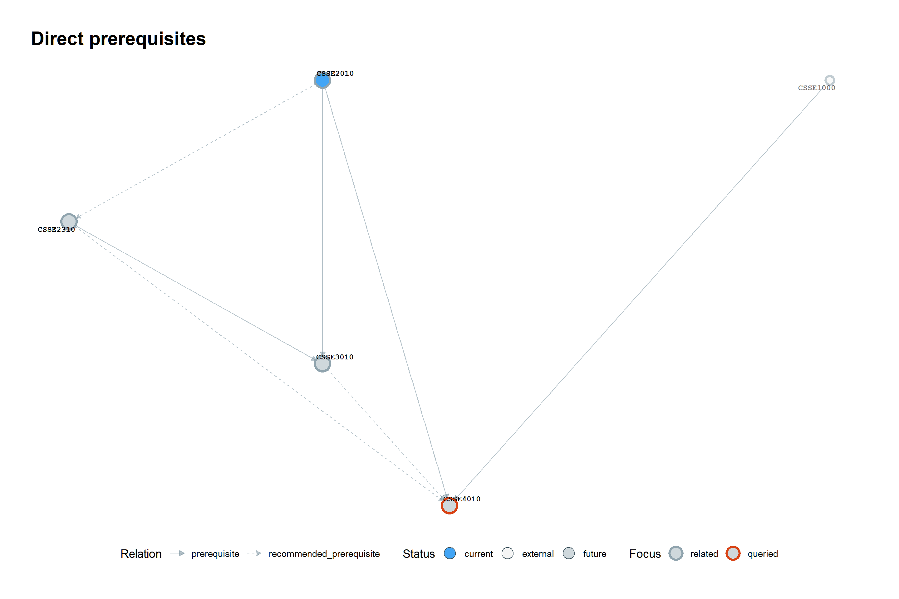

[Open original PNG](../assets/images/gallery/03-direct.png ':ignore') · [Read the tutorial](selectors/ancestors.md) · [Download this R recipe](https://raw.githubusercontent.com/PelerYuan/uq-course-graph/master/examples/gallery/03-direct.R ':ignore')

```r
# Run from the repository root after installing dependencies.
source("R/build_graph.R")
source("R/visualize_graph.R")
source("R/plot_stats.R")

# A bundled example: no scraping, config.R, or private RDS file is needed.
courses_file <- "examples/gallery_courses.csv"
edges_file <- "examples/prereq_edges.csv"
g <- build_course_graph(courses_file, edges_file)

# Illustrative statuses, not a real student's record.
g <- tag_course_status(g,
  completed = c("CSSE1001", "MATH1051"), current = "CSSE2010")
output_dir <- "output/gallery"
dir.create(output_dir, recursive = TRUE, showWarnings = FALSE)
set.seed(20260910)
output_file <- file.path(output_dir, "03-direct.png")

view <- select_ancestors(g, "CSSE4010", depth = 1)
plot_course_graph(view, output_file, title = "Direct prerequisites",
                  width = 12, height = 8, dpi = 240)
```


## Two levels of prerequisites :id=view-04-two-levels

**What comes before the direct prerequisites?** depth = 2 adds one more upstream layer. The orange outline marks the queried course; other nodes provide prerequisite context.

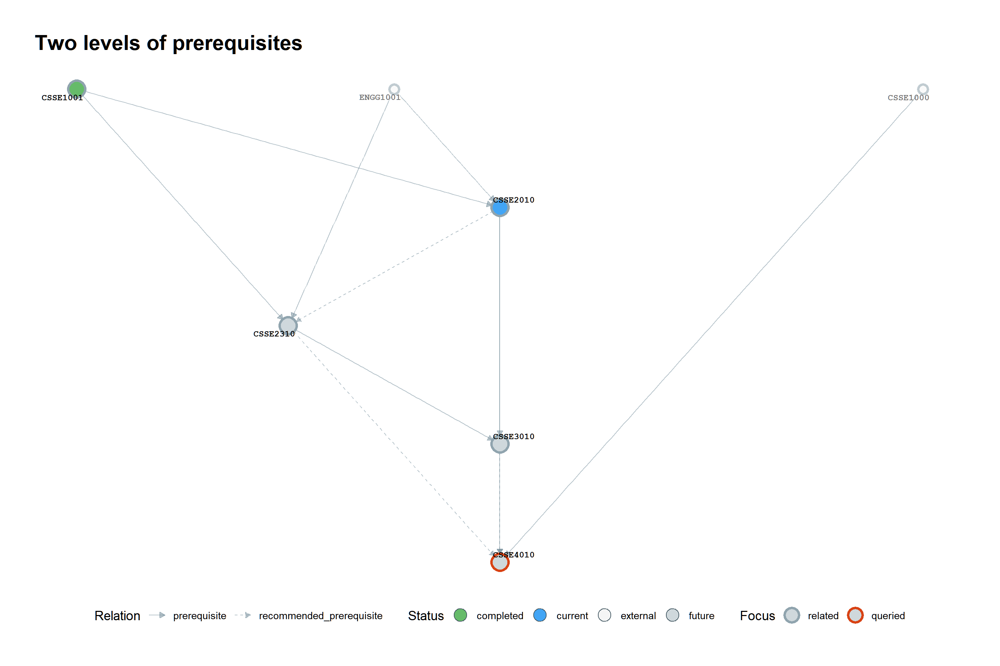

[Open original PNG](../assets/images/gallery/04-two-levels.png ':ignore') · [Read the tutorial](selectors/ancestors.md) · [Download this R recipe](https://raw.githubusercontent.com/PelerYuan/uq-course-graph/master/examples/gallery/04-two-levels.R ':ignore')

```r
# Run from the repository root after installing dependencies.
source("R/build_graph.R")
source("R/visualize_graph.R")
source("R/plot_stats.R")

# A bundled example: no scraping, config.R, or private RDS file is needed.
courses_file <- "examples/gallery_courses.csv"
edges_file <- "examples/prereq_edges.csv"
g <- build_course_graph(courses_file, edges_file)

# Illustrative statuses, not a real student's record.
g <- tag_course_status(g,
  completed = c("CSSE1001", "MATH1051"), current = "CSSE2010")
output_dir <- "output/gallery"
dir.create(output_dir, recursive = TRUE, showWarnings = FALSE)
set.seed(20260910)
output_file <- file.path(output_dir, "04-two-levels.png")

view <- select_ancestors(g, "CSSE4010", depth = 2)
plot_course_graph(view, output_file, title = "Two levels of prerequisites",
                  width = 12, height = 8, dpi = 240)
```


## The complete prerequisite chain :id=view-05-all-ancestors

**Which foundations lead to CSSE4010?** depth = Inf retains every node reachable upstream. In this snapshot, depth = 1 keeps 5 nodes and depth = 2 already reaches all 7 upstream-and-focus nodes, so the two-level and unlimited views have the same nodes and edges. This is expected, not a selector failure. Traversal includes both prerequisite and recommended-prerequisite edges; inspect line styles and the parsed logic before making enrolment decisions.

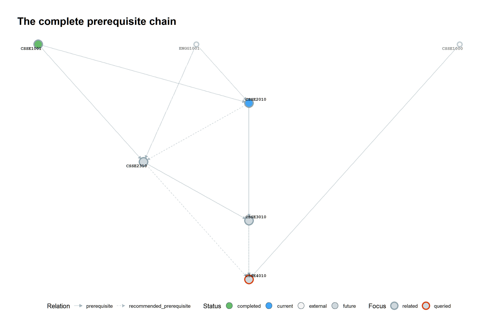

[Open original PNG](../assets/images/gallery/05-all-ancestors.png ':ignore') · [Read the tutorial](selectors/ancestors.md) · [Download this R recipe](https://raw.githubusercontent.com/PelerYuan/uq-course-graph/master/examples/gallery/05-all-ancestors.R ':ignore')

```r
# Run from the repository root after installing dependencies.
source("R/build_graph.R")
source("R/visualize_graph.R")
source("R/plot_stats.R")

# A bundled example: no scraping, config.R, or private RDS file is needed.
courses_file <- "examples/gallery_courses.csv"
edges_file <- "examples/prereq_edges.csv"
g <- build_course_graph(courses_file, edges_file)

# Illustrative statuses, not a real student's record.
g <- tag_course_status(g,
  completed = c("CSSE1001", "MATH1051"), current = "CSSE2010")
output_dir <- "output/gallery"
dir.create(output_dir, recursive = TRUE, showWarnings = FALSE)
set.seed(20260910)
output_file <- file.path(output_dir, "05-all-ancestors.png")

view <- select_ancestors(g, "CSSE4010", depth = Inf)
plot_course_graph(view, output_file, title = "The complete prerequisite chain",
                  width = 12, height = 8, dpi = 240)
```


## Downstream pathways :id=view-06-descendants

**Which courses are downstream of CSSE1001?** The outgoing traversal shows structural reachability. Completing CSSE1001 alone does not make every displayed course available: other prerequisites, alternatives, grades, and offering rules still matter.

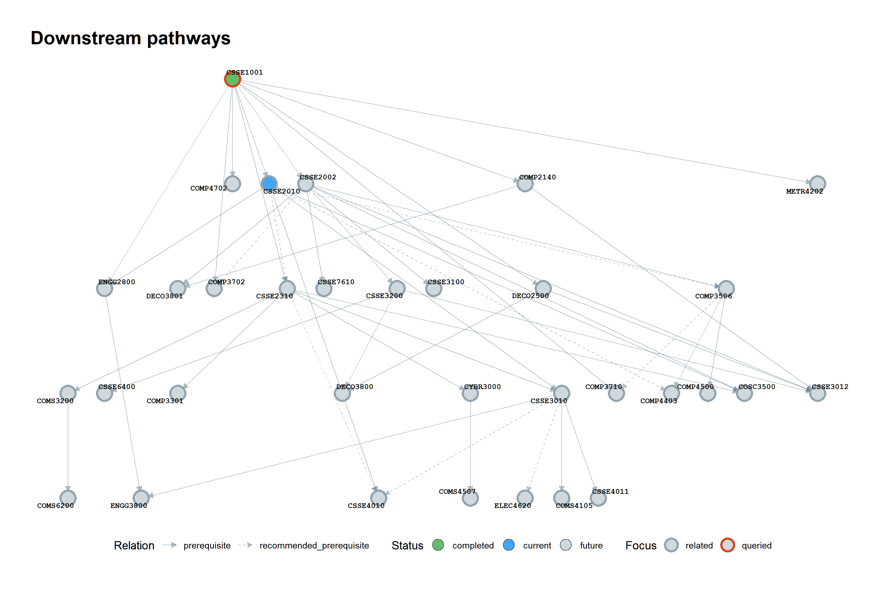

[Open original PNG](../assets/images/gallery/06-descendants.png ':ignore') · [Read the tutorial](selectors/descendants.md) · [Download this R recipe](https://raw.githubusercontent.com/PelerYuan/uq-course-graph/master/examples/gallery/06-descendants.R ':ignore')

```r
# Run from the repository root after installing dependencies.
source("R/build_graph.R")
source("R/visualize_graph.R")
source("R/plot_stats.R")

# A bundled example: no scraping, config.R, or private RDS file is needed.
courses_file <- "examples/gallery_courses.csv"
edges_file <- "examples/prereq_edges.csv"
g <- build_course_graph(courses_file, edges_file)

# Illustrative statuses, not a real student's record.
g <- tag_course_status(g,
  completed = c("CSSE1001", "MATH1051"), current = "CSSE2010")
output_dir <- "output/gallery"
dir.create(output_dir, recursive = TRUE, showWarnings = FALSE)
set.seed(20260910)
output_file <- file.path(output_dir, "06-descendants.png")

view <- select_descendants(g, "CSSE1001", depth = Inf)
plot_course_graph(view, output_file, title = "Downstream pathways",
                  width = 12, height = 8, dpi = 240)
```


## A local neighborhood :id=view-07-neighborhood

**What is connected to CSSE2310 within one step?** mode = all is used internally: incoming and outgoing edges are traversed without regard to direction. At larger depths this can include sibling branches, not just ancestors and descendants.

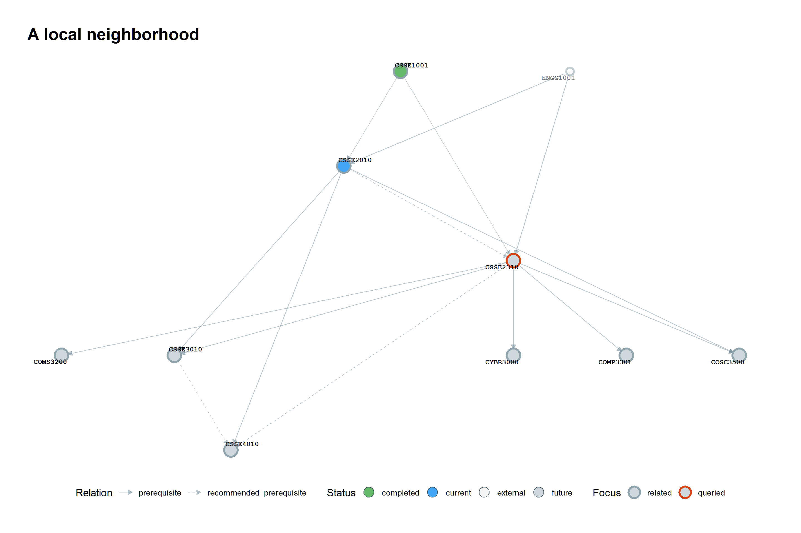

[Open original PNG](../assets/images/gallery/07-neighborhood.png ':ignore') · [Read the tutorial](selectors/neighborhood.md) · [Download this R recipe](https://raw.githubusercontent.com/PelerYuan/uq-course-graph/master/examples/gallery/07-neighborhood.R ':ignore')

```r
# Run from the repository root after installing dependencies.
source("R/build_graph.R")
source("R/visualize_graph.R")
source("R/plot_stats.R")

# A bundled example: no scraping, config.R, or private RDS file is needed.
courses_file <- "examples/gallery_courses.csv"
edges_file <- "examples/prereq_edges.csv"
g <- build_course_graph(courses_file, edges_file)

# Illustrative statuses, not a real student's record.
g <- tag_course_status(g,
  completed = c("CSSE1001", "MATH1051"), current = "CSSE2010")
output_dir <- "output/gallery"
dir.create(output_dir, recursive = TRUE, showWarnings = FALSE)
set.seed(20260910)
output_file <- file.path(output_dir, "07-neighborhood.png")

view <- select_neighborhood(g, "CSSE2310", depth = 1)
plot_course_graph(view, output_file, title = "A local neighborhood",
                  width = 12, height = 8, dpi = 240)
```


## Keep only one discipline :id=view-08-prefix-filter

**What remains when only ELEC courses are kept?** A hard filter removes all other prefixes, including any prerequisite bridges through mathematics or computing. Compare this with the next image, which preserves the full graph.

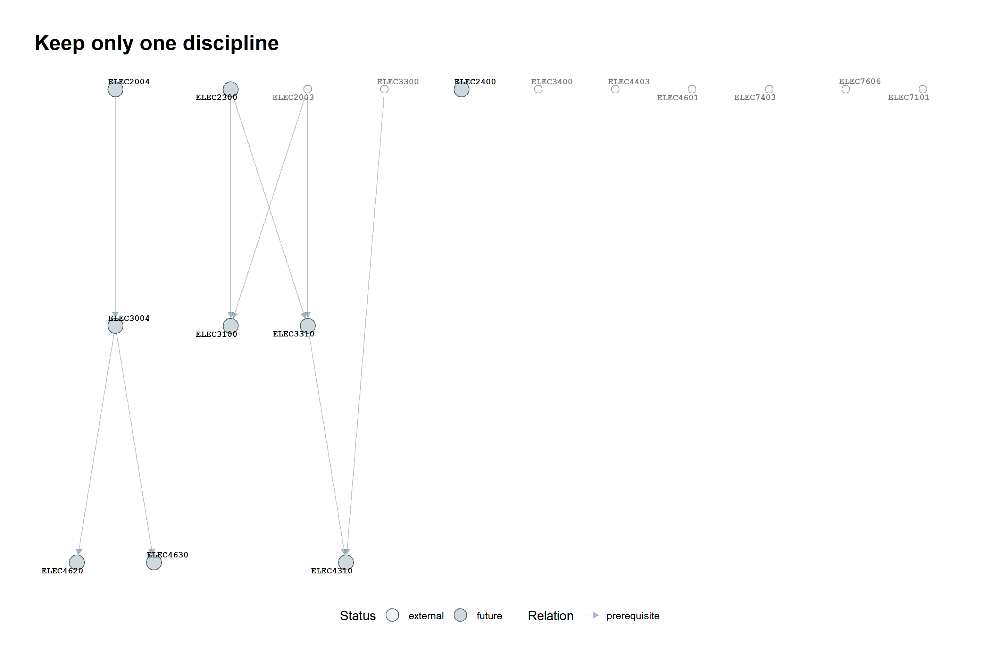

[Open original PNG](../assets/images/gallery/08-prefix-filter.png ':ignore') · [Read the tutorial](selectors/prefixes.md) · [Download this R recipe](https://raw.githubusercontent.com/PelerYuan/uq-course-graph/master/examples/gallery/08-prefix-filter.R ':ignore')

```r
# Run from the repository root after installing dependencies.
source("R/build_graph.R")
source("R/visualize_graph.R")
source("R/plot_stats.R")

# A bundled example: no scraping, config.R, or private RDS file is needed.
courses_file <- "examples/gallery_courses.csv"
edges_file <- "examples/prereq_edges.csv"
g <- build_course_graph(courses_file, edges_file)

# Illustrative statuses, not a real student's record.
g <- tag_course_status(g,
  completed = c("CSSE1001", "MATH1051"), current = "CSSE2010")
output_dir <- "output/gallery"
dir.create(output_dir, recursive = TRUE, showWarnings = FALSE)
set.seed(20260910)
output_file <- file.path(output_dir, "08-prefix-filter.png")

view <- select_by_prefix(g, "ELEC")
plot_course_graph(view, output_file, title = "Keep only one discipline",
                  width = 12, height = 8, dpi = 240)
```


## Highlight without removing context :id=view-09-prefix-highlight

**Where does ELEC sit in the full curriculum?** highlight_prefix dims other disciplines without deleting their nodes or edges. This image and the full overview contain the same network; only visual emphasis changes.

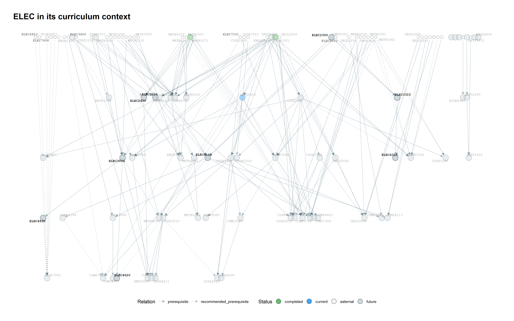

[Open original PNG](../assets/images/gallery/09-prefix-highlight.png ':ignore') · [Read the tutorial](selectors/prefixes.md) · [Download this R recipe](https://raw.githubusercontent.com/PelerYuan/uq-course-graph/master/examples/gallery/09-prefix-highlight.R ':ignore')

```r
# Run from the repository root after installing dependencies.
source("R/build_graph.R")
source("R/visualize_graph.R")
source("R/plot_stats.R")

# A bundled example: no scraping, config.R, or private RDS file is needed.
courses_file <- "examples/gallery_courses.csv"
edges_file <- "examples/prereq_edges.csv"
g <- build_course_graph(courses_file, edges_file)

# Illustrative statuses, not a real student's record.
g <- tag_course_status(g,
  completed = c("CSSE1001", "MATH1051"), current = "CSSE2010")
output_dir <- "output/gallery"
dir.create(output_dir, recursive = TRUE, showWarnings = FALSE)
set.seed(20260910)
output_file <- file.path(output_dir, "09-prefix-highlight.png")

view <- g
plot_course_graph(view, output_file, title = "ELEC in its curriculum context",
                  highlight_prefix = "ELEC", width = 16, height = 10, dpi = 240)
```


## Combine traversal and discipline :id=view-10-composition

**Which CSSE and ELEC courses are downstream of CSSE1001?** First traverse the original graph, then keep two disciplines. Reversing this order can lose paths that pass through other prefixes. The final filtered graph can still omit those intermediate nodes.

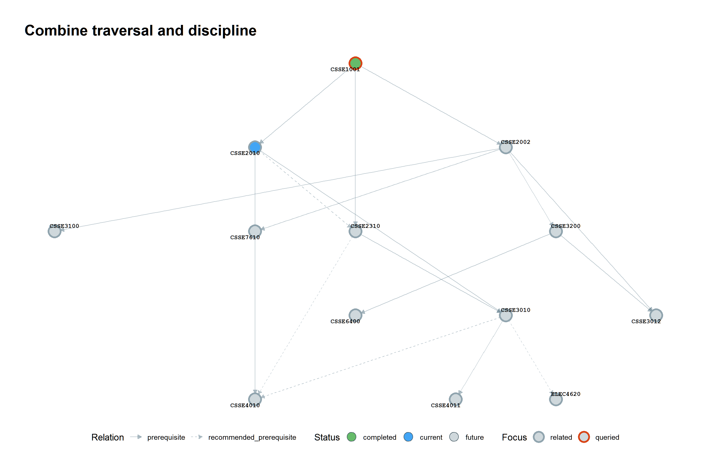

[Open original PNG](../assets/images/gallery/10-composition.png ':ignore') · [Read the tutorial](selectors/composition.md) · [Download this R recipe](https://raw.githubusercontent.com/PelerYuan/uq-course-graph/master/examples/gallery/10-composition.R ':ignore')

```r
# Run from the repository root after installing dependencies.
source("R/build_graph.R")
source("R/visualize_graph.R")
source("R/plot_stats.R")

# A bundled example: no scraping, config.R, or private RDS file is needed.
courses_file <- "examples/gallery_courses.csv"
edges_file <- "examples/prereq_edges.csv"
g <- build_course_graph(courses_file, edges_file)

# Illustrative statuses, not a real student's record.
g <- tag_course_status(g,
  completed = c("CSSE1001", "MATH1051"), current = "CSSE2010")
output_dir <- "output/gallery"
dir.create(output_dir, recursive = TRUE, showWarnings = FALSE)
set.seed(20260910)
output_file <- file.path(output_dir, "10-composition.png")

view <- select_descendants(g, "CSSE1001", depth = Inf) |>
  select_by_prefix(c("CSSE", "ELEC"))
plot_course_graph(view, output_file, title = "Combine traversal and discipline",
                  width = 12, height = 8, dpi = 240)
```


## Gateway courses :id=view-11-gateways

**Which courses reach the largest downstream networks?** The ranking is recomputed from the same example graph. Reachability counts are not degree requirements or a recommended study order; both edge types participate in this graph.

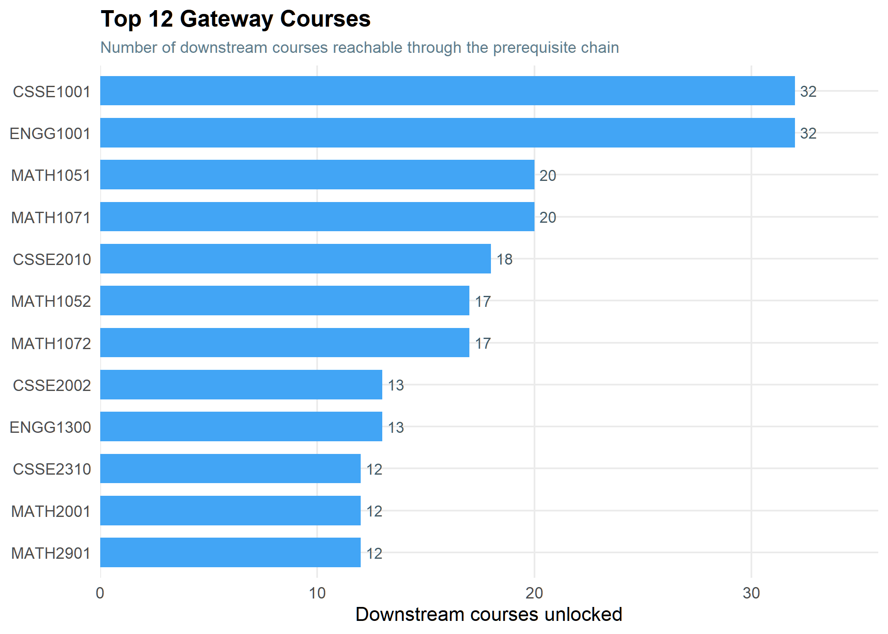

[Open original PNG](../assets/images/gallery/11-gateways.png ':ignore') · [Read the tutorial](results/statistics.md) · [Download this R recipe](https://raw.githubusercontent.com/PelerYuan/uq-course-graph/master/examples/gallery/11-gateways.R ':ignore')

```r
# Run from the repository root after installing dependencies.
source("R/build_graph.R")
source("R/visualize_graph.R")
source("R/plot_stats.R")

# A bundled example: no scraping, config.R, or private RDS file is needed.
courses_file <- "examples/gallery_courses.csv"
edges_file <- "examples/prereq_edges.csv"
g <- build_course_graph(courses_file, edges_file)

# Illustrative statuses, not a real student's record.
g <- tag_course_status(g,
  completed = c("CSSE1001", "MATH1051"), current = "CSSE2010")
output_dir <- "output/gallery"
dir.create(output_dir, recursive = TRUE, showWarnings = FALSE)
set.seed(20260910)
output_file <- file.path(output_dir, "11-gateways.png")

ranking_file <- file.path(output_dir, "key_courses.csv")
write.csv(rank_key_courses(g), ranking_file, row.names = FALSE)
plot_key_courses(ranking_file, top_n = 12, output_file = output_file)
```


## Discipline and course level :id=view-12-disciplines

**How is the course list distributed?** This chart counts the bundled course list rather than the graph, so external prerequisite nodes are excluded. Level is the fifth character of the course code, not a scheduled year of study.


[Open original PNG](../assets/images/gallery/12-disciplines.png ':ignore') · [Read the tutorial](results/statistics.md) · [Download this R recipe](https://raw.githubusercontent.com/PelerYuan/uq-course-graph/master/examples/gallery/12-disciplines.R ':ignore')

```r
# Run from the repository root after installing dependencies.
source("R/build_graph.R")
source("R/visualize_graph.R")
source("R/plot_stats.R")

# A bundled example: no scraping, config.R, or private RDS file is needed.
courses_file <- "examples/gallery_courses.csv"
edges_file <- "examples/prereq_edges.csv"
g <- build_course_graph(courses_file, edges_file)

# Illustrative statuses, not a real student's record.
g <- tag_course_status(g,
  completed = c("CSSE1001", "MATH1051"), current = "CSSE2010")
output_dir <- "output/gallery"
dir.create(output_dir, recursive = TRUE, showWarnings = FALSE)
set.seed(20260910)
output_file <- file.path(output_dir, "12-disciplines.png")

plot_prefix_by_level(courses_file, output_file = output_file)
```


## Use your own curriculum

After the [complete workflow](getting-started.md) has built your graph, replace the `build_course_graph(...)` line in a network recipe with `g <- readRDS("data/graph_object.rds")`. Choose course codes and prefixes that exist in your graph, and update the illustrative status lists. For the discipline chart, also set `courses_file <- "data/courses_info.csv"`.

`depth = 1`, `depth = 2`, and `depth = Inf` change how far a traversal reaches. `select_by_prefix()` removes nodes; `highlight_prefix` changes their appearance. `width` and `height` are in inches; together with `dpi` they determine the PNG resolution. The examples deliberately use different plot sizes for the full network and focused views.

Find signatures in the [selector reference](reference/selectors.md) and [plotting reference](reference/plotting.md). Continue with [selector recipes](selectors/overview.md) for more explanation, or [troubleshooting](troubleshooting.md) if a code is missing or your result differs. Exact label positions can vary with R packages, fonts, and graphics devices even with a fixed seed.
