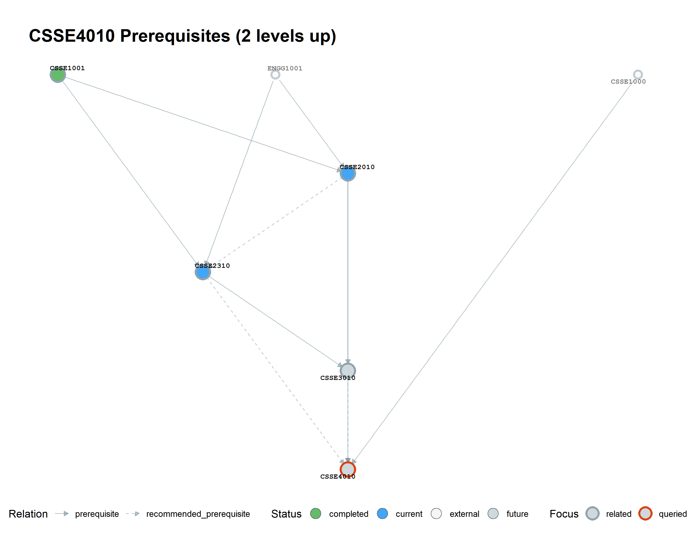
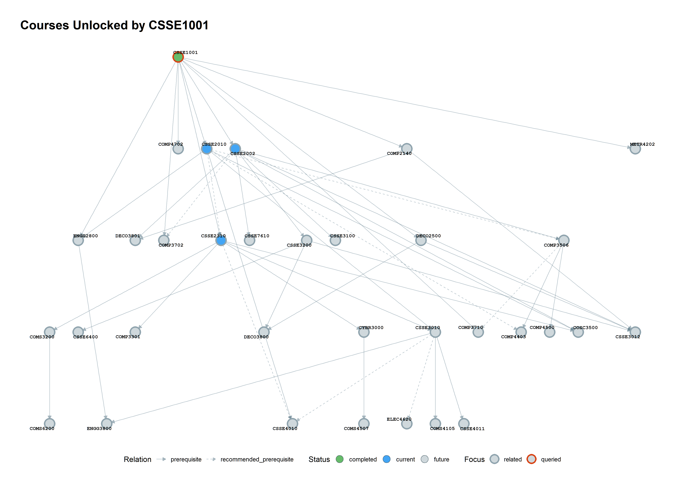

# Complete workflow

This page follows one question from start to finish:

> What do I need before `CSSE4010`, and what can `CSSE1001` unlock?

The same code works for another UQ plan after you change the configuration.

## Before you begin

You need R 4.1 or newer, Google Chrome, and a clone of the repository. The scraping stage needs internet access. Later stages can run from saved files.

Read [installation](installation.md), then create a private `config.R` from `config.example.R`. The private file is ignored by Git so your course status choices are not committed accidentally.

## Configure the source

```r
PROGRAM_CODE <- "ELECEX2350"
PROGRAM_ROUTE_TYPE <- "plan"
ACADEMIC_YEAR <- 2026
COMPLETED_COURSES <- c("MATH1051")
CURRENT_COURSES <- c("CSSE2310")
REQUEST_DELAY <- 1
REQUEST_TIMEOUT <- 30
```

A plan URL contains `/requirements/plan/`; a program URL contains `/requirements/program/`. Keep the route type and code consistent with the URL.

## Run and inspect each stage

### Stage 1: scrape

```r
source("01_scrape.R")
```

The result is `data/course_codes.csv` plus `data/courses_info.csv`. Open the latter and check that it contains one row per discovered course and the prerequisite columns.

### Stage 2: parse

```r
source("02_parse.R")
```

The parser writes `prereq_edges.csv`, `prereq_logic.csv`, and `manual_review.csv`. The edge table is convenient for graph traversal. The logic table preserves alternatives such as `MATH1051 OR MATH1071`.

### Stage 3: review

Read the manual-review CSV in a spreadsheet. Keep credit rules and grade rules as special requirements. Add a course edge only when the text explicitly supports it. Then run `source("03_review.R")`.

### Stage 4: build

```r
source("04_build_graph.R")
```

The graph is saved as `data/graph_object.rds`. External prerequisite courses are included as lighter nodes even when they are outside your selected plan.

### Stage 5: visualize

```r
source("05_visualize.R")
```

The default full graph is saved in `output/course_dependency_graph.png`.

## Answer the planning questions

```r
source("config.R")
source("R/visualize_graph.R")
g <- readRDS(file.path(DATA_DIR, "graph_object.rds"))
g <- tag_course_status(g, COMPLETED_COURSES, CURRENT_COURSES)

select_ancestors(g, "CSSE4010", depth = 2) |>
  plot_course_graph("output/csse4010_prerequisites.png",
                    title = "CSSE4010 prerequisites within two levels")

select_descendants(g, "CSSE1001") |>
  plot_course_graph("output/csse1001_unlocks.png",
                    title = "Courses unlocked by CSSE1001")
```





## What to do next

Read [how selectors work](selectors/overview.md), then use the [reference pages](reference/selectors.md) to adapt the examples.
