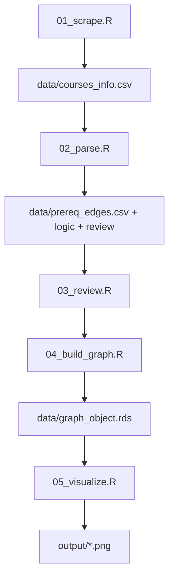

# Pipeline overview

The numbered scripts are intentionally boring orchestration. They call reusable functions in `R/`, write predictable files, and can be rerun in order.

Run from the repository root. Relative paths in the scripts are based on that directory.

| Stage | Network | Main input | Main output |
| --- | --- | --- | --- |
| Scrape | Yes | `config.R` | course CSV files |
| Parse | No | course CSV | edges, logic, review |
| Review | No | review CSV | corrected edges and special rules |
| Build | No | courses and edges | graph RDS and rankings |
| Visualize | No | graph RDS | PNG figures |

A stage should fail clearly when a required file is absent. Do not skip directly to visualization unless a graph object already exists.
