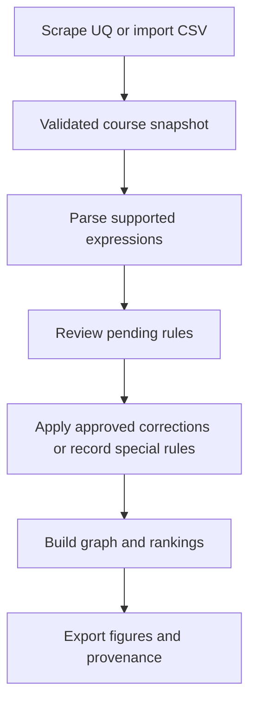

# Pipeline overview

Start with the [complete workflow](../getting-started.md) for a runnable offline example. Both the installed package and numbered scripts call the same stage functions.

| Stage | Network | Main output | Completion condition |
| --- | --- | --- | --- |
| Scrape / import | Scrape only | `courses_info.csv` | Every course has valid metadata |
| Parse | No | Automatic edges, logic, review queue | Source checksum matches |
| Review | No | Canonical edges, logic, special rules | No pending decisions |
| Graph | No | `graph_object.rds`, `key_courses.csv` | Fresh review, no cycle |
| Plot | No | PNG and manifests | Fresh graph and upstream inputs |

`project_paths(config)` locates every file. For the default configuration, data lives under `data/plan-ELECEX2350-2026/` and figures under `output/plan-ELECEX2350-2026/`. Changing the code, route, or year creates a separate workspace.

The source scripts read `config.R` from the repository root. An installed package accepts `uq_config()` directly. After an intentional source replacement, rerun parse, review, graph, and plot. Review decisions survive only when their original course, field, and text are unchanged. See [reproducibility](../reproducibility.md) for freshness checks and [migration](../migration.md) for older workspaces.
