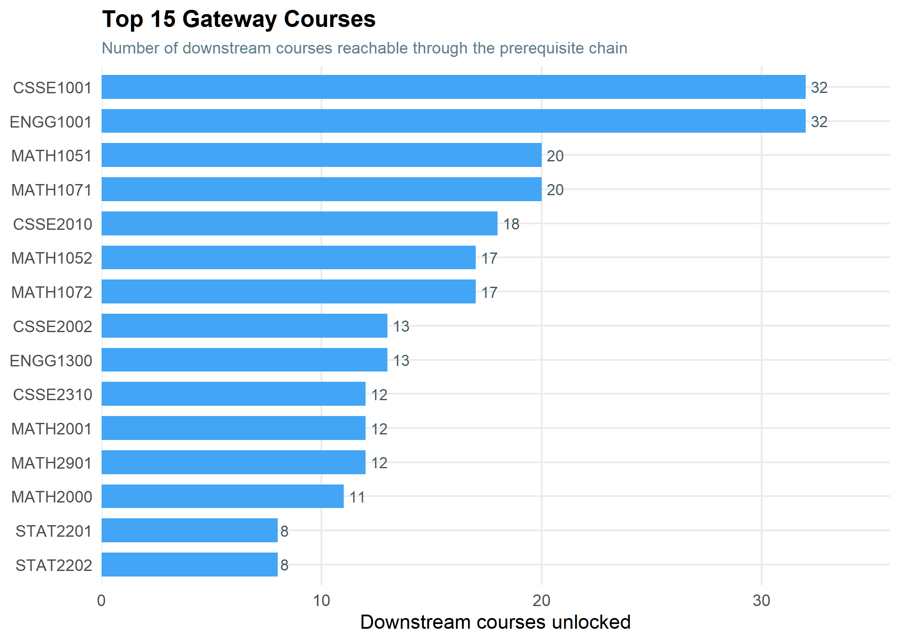
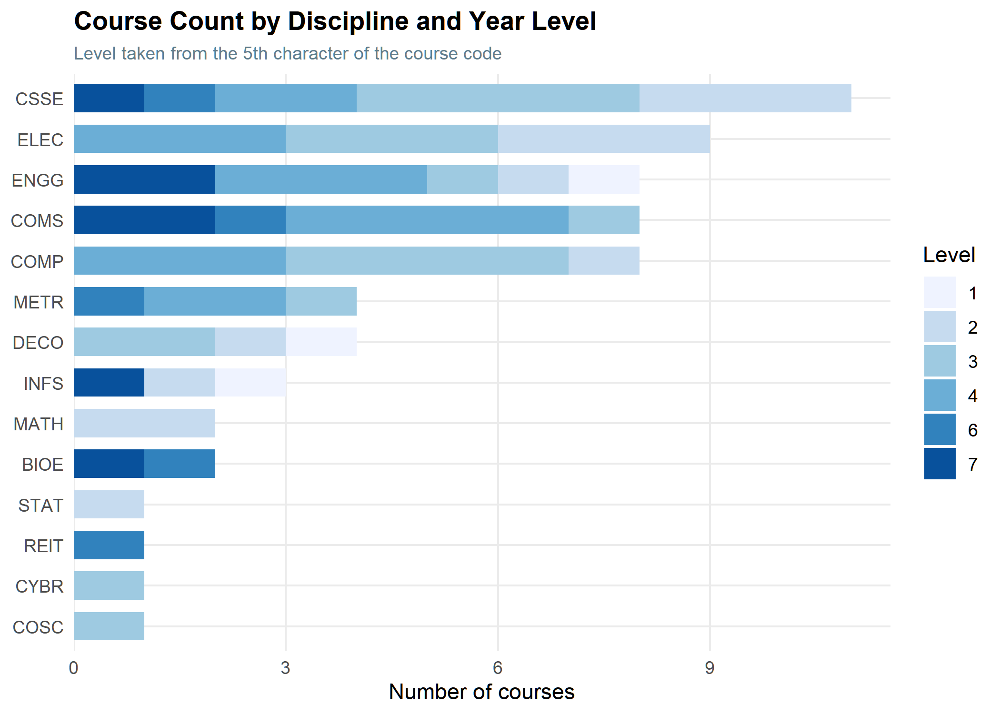
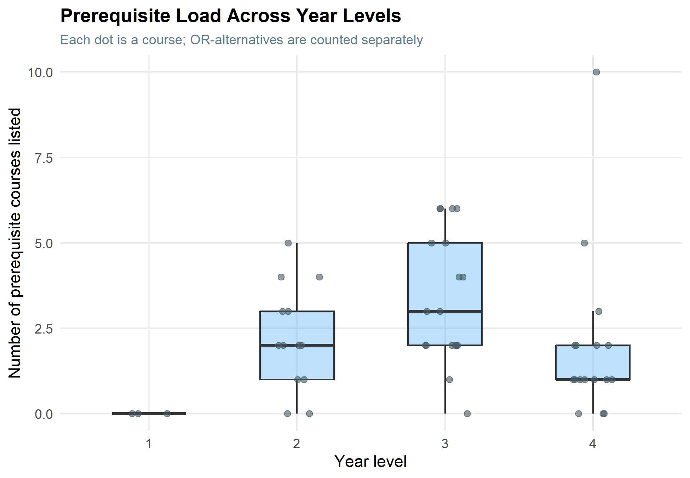
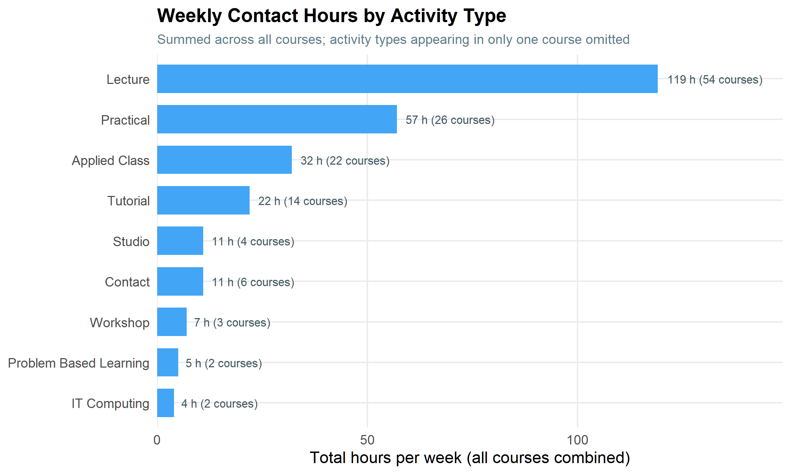
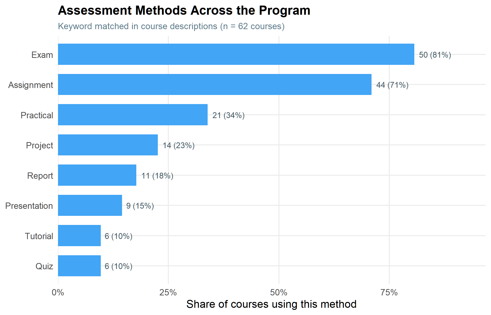

# Statistics

The statistics functions read CSV outputs and answer questions about course distribution and workload.

Run the functions from `R/plot_stats.R` and keep the input CSV files with exported images. The prerequisite-count plot treats OR alternatives as separate listed courses, so its values are an upper bound.
