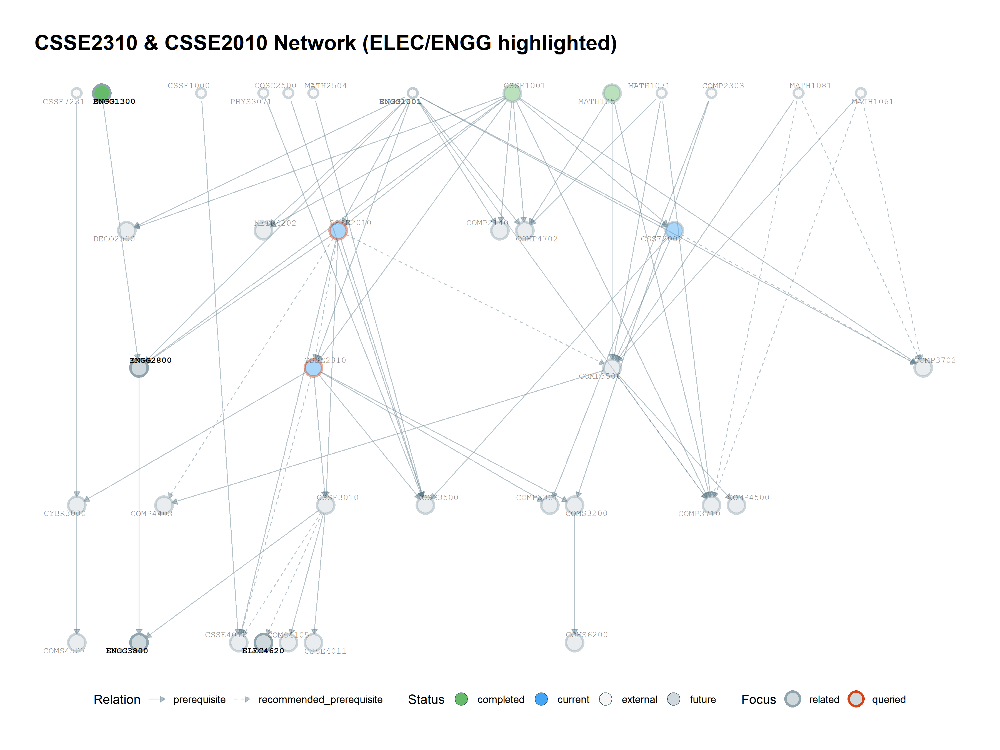

# Neighborhoods

`select_neighborhood()` follows both directions from one or more focus courses.

```r
select_neighborhood(g, c("CSSE2310", "ELEC2400"), depth = 2) |>
  plot_course_graph("output/neighborhood.png", title = "Two-level neighborhood")
```

A neighborhood is useful when you want context around a current course. It can become dense quickly, so start with depth 1 or 2.


