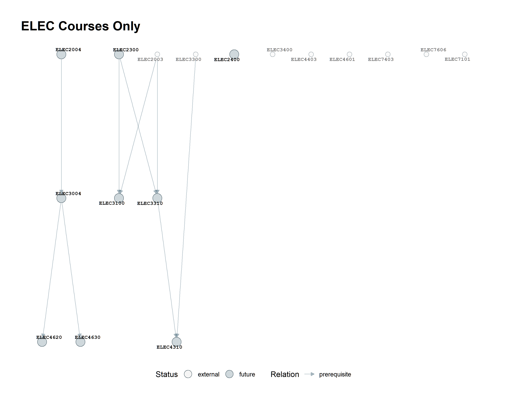

# Discipline filters and highlights

## Hard filter

`select_by_prefix()` removes nodes outside the requested four-letter prefixes:

```r
select_by_prefix(g, c("CSSE", "ELEC")) |>
  plot_course_graph("output/csse_elec_only.png", title = "CSSE and ELEC only")
```



Hard filtering can remove real cross-discipline prerequisites. It is appropriate when the question is specifically about an isolated discipline.

## Soft highlight

Use `highlight_prefix` when relationships must remain visible:

```r
select_neighborhood(g, "CSSE2310", depth = 2) |>
  plot_course_graph("output/highlighted.png",
                    highlight_prefix = c("CSSE", "ELEC"),
                    title = "Highlighted disciplines")
```


